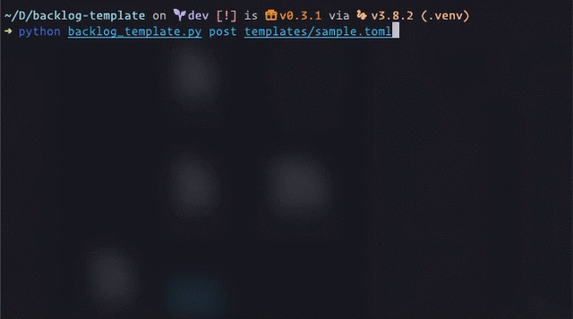

# backlog-template

Python CLI tool for posting template issues to Backlog project.



## Requirements

- Python 3.8 or later
- Poetry 1.0.0 or later (dependency manager)

## Installation

Use [Poetry](https://python-poetry.org) to install dependent packages.

```sh
poetry install
```

## How to use

After configured properly,

1. Activate virtual environment
2. Let the program eat template file written in [TOML](https://github.com/toml-lang/toml).

```sh
poetry shell
python backlog_template.py templates/template.toml
```

## Configurations

### Environment variables (required)

Create `backlog_template.toml` to the same directory. All environment variables are stored in this TOML file.

These values are required.

- `SPACE_DOMAIN`: Backlog domain (ex: example.backlog.com)
- `API_KEY`: Backlog API key (cf. [Backlog Help Center - API Settings](https://support.backlog.com/hc/en-us/articles/115015420567-API-Settings))
- `PROJECT`: Backlog project name

#### Example of `backlog_tempalte.toml`

```toml
[backlog_template]
SPACE_DOMAIN = "your_space_name.backlog.com"
API_KEY = "0123456789yOuRaPiKeY9876543210"
PROJECT = "YOUR_PROJECT"
```

### Template

Strings in curly braces will be replaced upon the post by the dictionary defined in `[repl]`.

#### Mandatory keys

- summary
- issueType
- priority

#### Optional keys

- description
- milestone
- version
- dueDate (must be formatted as `yyyy-MM-dd`)
- assignee

#### Example of template

```toml
[repl]
SUMMARY = "a issue"
GOAL = "a goal"
CHILD_DUE_DATE = "2025-01-01"

[issue]
summary = "{SUMMARY}"
issueType = "Bug"
description = "## TL;DR\n\nThis task must be done to achiveve {GOAL}."
milestone = "1.0.0"
priority = "High"
assignee = "John Smith"

[[issue.children]]
summary = "a child issue of {SUMMARY}"
issueType = "Task"
description = "## a child issue of {SUMMARY}\nThis issue is essential to achieve {GOAL}."
version = "1.0.0"
milestone = "1.0.0"
priority = "High"
dueDate = "{CHILD_DUE_DATE}"
assignee = "John Smith"

[[issue.children]]
summary = "another child issue of {SUMMARY}"
issueType = "Task"
description = "## another child issue of {SUMMARY}\nThis issue is really important to achieve {GOAL}."
priority = "Low"
```
